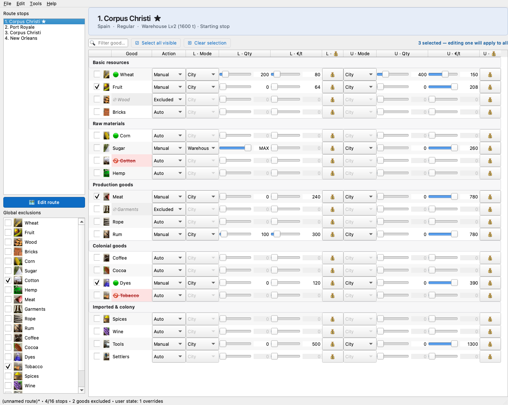
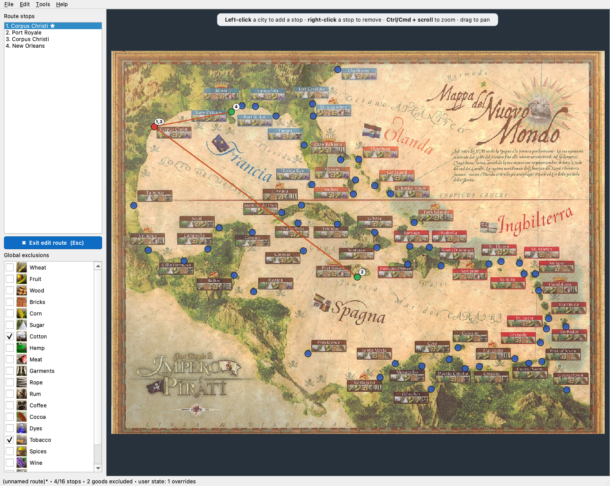

# Port Royale 2 — Trade Routes Editor

A standalone desktop editor for the **`.ahr` trade-route files** of
*Port Royale 2 — Empire & Pirates*. Build complex multi-stop routes with
per-good buy/sell thresholds, quantities and warehouse switching — without
running the game.




> *(Screenshots are generated by the dev scripts in the repo; the actual app
> rendering depends on your OS theme.)*

## What's in the box

- 🧬 **`.ahr` codec** with a byte-perfect roundtrip — encoder, decoder and a
  JSON-based builder, plus a CLI.
- 🗺️ **Interactive map of the Caribbean** with all 60 cities — left-click to
  add a stop, right-click to remove one, see the route lines and a dotted
  return leg.
- 📦 **Inline goods editor** for the 20 goods of every stop, grouped in 5
  sections, with sliders for qty (0–MAX) and price (per-good range from the
  config); multi-select checkboxes let you edit several goods at once
  (auto-propagation).
- 🏛️ **Per-game overrides** — warehouse level, current nation and
  recommended-price overrides per city, saved in `user_state.json`.
- 📦 **Standalone installers** for macOS (`.app`) and Windows (one-folder
  bundle) via PyInstaller.

## Quick start (from source)

```bash
git clone https://github.com/palumbamboo/portroyale-2-trade-routes-maker
cd portroyale-2-trade-routes-maker

# venv + dependencies (uv is recommended; pip works too)
uv venv --python 3.13 .venv
uv pip install --python .venv/bin/python -e ".[dev]"

# Launch the GUI
.venv/bin/python -m pr2_editor
```

The CLI is just `python ahr.py` from the same folder.

## Pre-built apps (Windows / macOS)

Releases are produced automatically: pushing a `vX.Y.Z` tag runs the
[`Build & release`](.github/workflows/release.yml) GitHub Actions workflow,
which builds the macOS (Apple Silicon / arm64) and Windows (x64) bundles and
attaches the zips to the matching GitHub Release. Grab the latest from the
[Releases page](https://github.com/palumbamboo/portroyale-2-trade-routes-maker/releases).
(Intel macs aren't built — run PyInstaller locally on an Intel machine if you
need an x86_64 bundle.)

To build locally instead:

```bash
# Install the build extra once
uv pip install --python .venv/bin/python -e ".[build]"

# macOS
.venv/bin/pyinstaller --clean --noconfirm build.spec
# Windows (PowerShell or cmd.exe)
.venv\Scripts\pyinstaller.exe --clean --noconfirm build.spec
```

Output (one-folder bundles — faster startup and friendlier to anti-virus
than `--onefile`):

- **macOS** → `dist/PR2 Routes Editor.app` — open with Finder.
- **Windows** → `dist/PR2RoutesEditor/PR2RoutesEditor.exe` — double-click.

Bundled read-only assets (config, map image, calibrated coordinates, icons)
ship inside the bundle. Writable per-user data goes to an OS-appropriate
folder so the installed app never tries to modify itself:

- macOS: `~/Library/Application Support/PR2RoutesEditor/`
- Windows: `%APPDATA%/PR2RoutesEditor/`

`pr2_editor/constants.py` resolves these paths automatically depending on
whether `sys.frozen` is set, so the same code runs in development and inside
the bundle.

The build is unsigned. On macOS the first launch needs *Right-click → Open*
(or `xattr -dr com.apple.quarantine "dist/PR2 Routes Editor.app"`). On
Windows SmartScreen may warn about an unknown publisher.

## CLI usage (`ahr.py`)

```bash
# Decode an .ahr into inspectable JSON
python ahr.py decode "route.ahr" "route.json"

# From raw JSON (output of decode) to .ahr
python ahr.py encode "route.json" "route.ahr"

# From user-friendly JSON to .ahr (see rotte/build/example-route.json)
python ahr.py build "spec.json" "route.ahr"

# Roundtrip identity check
python ahr.py roundtrip "route.ahr"

# List the city_ids of the stops (annotated with names if pr2_config.json is present)
python ahr.py cities "route.ahr"

# Decode every .ahr in a folder
python ahr.py decode-dir rotte/input rotte/parsed

# Regression test (roundtrip over every .ahr in a folder)
python ahr.py test rotte/test
```

## GUI tour

- **Edit route** button (left panel, accent colour) opens the **map view**.
  Hover a city for a tooltip with its name, nation, role, produced goods
  and warehouse. Left-click to add a stop; right-click to remove. Press
  **Esc** to return to the goods view.
- **Stops list** stays on the left. Drag rows to reorder.
- **Goods table** (right panel): one row per good, grouped in 5 sections —
  Basic resources / Raw materials / Production goods / Colonial goods /
  Imported & colony.
  - Action column: `Auto` / `Excluded` / `Manual`. Manual prefills the buy
    price to the good's market minimum and the sell price to its maximum.
  - Per-side qty slider (0–2000, end of travel = MAX) and price slider
    (range from `pr2_config.json` per good). The number box is always
    editable for overrides.
  - 💰 button applies the city's recommended buy/sell price.
    `Ctrl+Click` applies to both sides at once.
  - Right-click a row → copy/paste/reset the good's config.
- **Multi-select** — tick the checkbox on any row to add the good to a
  selection. With 2+ selected, editing any single row (action, mode, qty,
  price, 💰) auto-applies the same change to every selected good (manual
  goods only for trade edits).
- **Filter** input above the table hides goods whose name doesn't match.
- **🟢 prefix** marks goods produced by the current stop's city.
- **🚫 bold red strikethrough** marks route-excluded goods (global exclusion
  list); **⊘ italic gray** marks goods excluded at the current stop only.
- **Tools → Manage cities…** — per-game overrides (warehouse level, current
  nation, recommended-price overrides per good).

## Map calibration

The map view needs per-city `(x, y)` coordinates on the image. The repo ships
calibrated coordinates in `pr2_map_coords.json`. If you want to recalibrate
(e.g. after replacing the map image with a higher-resolution scan), use:

```bash
.venv/bin/python tools/calibrate_map.py
```

The tool walks city-by-city (60 in total): click on the matching city on the
map image, the (x, y) is recorded. Press *Save & quit* when done.

## Folder layout

```
.
├── ahr.py                    # decoder/encoder/builder + CLI (standalone library)
├── pr2_editor/               # GUI package (PySide6)
│   ├── __main__.py           #   `python -m pr2_editor`
│   ├── app.py                #   main(): QApplication + MainWindow
│   ├── constants.py
│   ├── icons.py
│   ├── route.py              #   current-route model
│   ├── store.py              #   config + user_state (per-game overrides)
│   ├── style.py              #   centralised palette + Qt stylesheet
│   ├── main_window.py
│   └── widgets/
│       ├── goods_table.py
│       ├── manage_cities_dialog.py
│       ├── map_view.py
│       └── row_widgets.py    #   QtySlider, PriceSlider, _ModifierToolButton
├── tools/
│   └── calibrate_map.py      # one-shot tool to record city (x, y) on the map
├── tests/                    # pytest: Store setters, Route model, .ahr roundtrip
├── pr2_config.json           # static config: 20 goods + 60 cities (read-only)
├── pr2_map_coords.json       # city -> (x, y) on the map image
├── port-royal2-2-map.jpg     # reference map
├── icons/                    # good icons (one PNG per good, named after the English good name)
├── build.spec                # PyInstaller spec, cross-platform
├── run.py                    # absolute-import launcher (PyInstaller entry point)
├── pyproject.toml            # PySide6 deps + dev pytest + build pyinstaller
├── LICENSE                   # MIT
├── CHANGELOG.md
├── CONTRIBUTING.md
└── rotte/                    # data folder (legacy name from the original project)
    ├── build/                # user-friendly JSON specs for the builder
    │   └── example-route.json
    └── test/                 # .ahr fixtures for regression tests
        └── fixture_rotta01.ahr
```

## `.ahr` format (summary)

```
Header (11 bytes):
  magic        4 bytes  = 0x41 0x04 0x00 0x00 ("A" + 0x04)
  nstops       1 byte   number of stops (1-16)
  capacity     1 byte   ceil(nstops/4)*4, capped at 16
  bitmap       5 bytes  route exclusions (1 bit = 1 active good)

Stop (426 bytes, repeated nstops times):
  display_order   20 bytes   permutation 0..19 (manuals on top in the UI)
  actions[20]     u32 LE     0=excluded, 1=auto, 2=manual
  trades[20]      16 bytes each:
    load_price    u32 LE     city threshold (gold/ton); 0xFFFFFFFF = "from warehouse"
    load_qty      u16 LE     quantity (0xFFFF = "max")
    load_aux      u16 LE     snapshot residue, preserved for roundtrip
    unload_price  u32 LE     same as above for unload
    unload_qty    u16 LE
    unload_aux    u16 LE
  trailer         6 bytes    city_id, 0x00, 0x21, 0x00, start_flag, 0x00
```

## Tests

```bash
# .ahr codec regression
python ahr.py test rotte/test

# pytest suite (Store, Route, roundtrip)
.venv/bin/pytest
```

## Contributing

See [CONTRIBUTING.md](CONTRIBUTING.md). Bug reports and PRs welcome.

## Disclaimer

This is an **unofficial, fan-made tool**. *Port Royale 2 — Empire & Pirates*
is a trademark of its respective rights holders (Ascaron Entertainment /
Kalypso Media). This project is not affiliated with or endorsed by them.
The editor does not include or redistribute any game assets beyond the
reverse-engineered file-format description, the gameplay metadata users
have collected, and a low-resolution reference map kept solely as a UI
backdrop. You need to own a legitimate copy of the game for the produced
`.ahr` files to be useful.

## License

[MIT](LICENSE). Copyright (c) 2026 palumbamboo.
